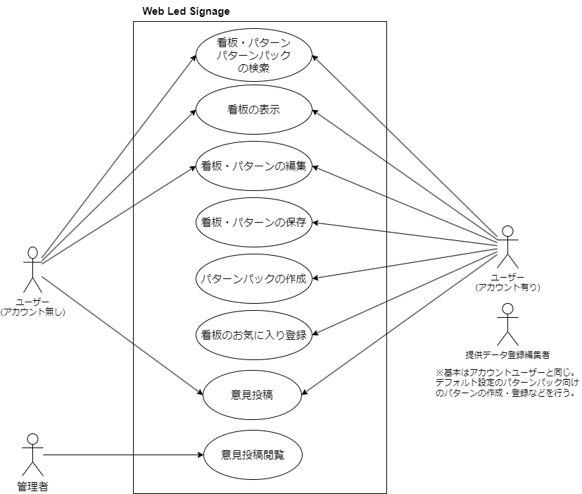
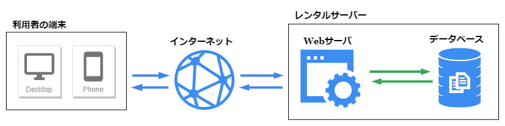

# 要件定義書

## 【概要】
Web上で動くLED電光掲示板の表示・編集を行うWebアプリケーションの新規開発に関する要件定義書です。

---
### 【サービス名】
『Web Led Signage』

---
### 【用語定義】
<dl>
	<dt>看板(Signage)</dt>
	<dd>実際にWeb上で再現するLED電光掲示</dd>
	<dt>パターン(Pattern)</dt>
	<dd>看板データを作る際に利用できる小さいサイズのパターン(文字や記号など)</dd>
	<dt>パターンパック</dt>
	<dd>パターンを文字コード等で紐づけしてまとめた物</dd>
</dl>

---
## 【システム方式・構成】
### 【機能要件】
### 『検索機能』
* 公開設定されている看板・パターン・パターンパックを検索する。
* 検索結果は一覧表示する。
* 検索結果にはログインしているユーザーが作成したものを含む。
* 見たいデータをクリックするとポップアップで詳細情報を確認出来る。
* ログインしているユーザー以外のユーザーの看板をお気に入り登録・解除が出来る。
* 一覧表示と詳細表示のどちらでもお気に入り操作が出来る。

#### ☆検索方法
* 名前検索
* タグ検索
* お気に入り登録で絞り込み

#### ☆詳細情報で取得する内容
* 作成者(ユーザー表示名)
* 名前
* 説明
* タグ
* 更新日
* お気に入り登録状態(ログインユーザーのみ)

※Ajaxを利用する

### 『表示機能』(Viewer)
* 自分の看板や、他ユーザーの公開設定の看板を選んで表示を行う。  
* コントロールパネルから看板の表示設定を行う。  
* 看板データの外部ファイル読み込みが出来る。 
* 編集を行いたい場合は編集機能へ移動する(ログインしているユーザーが作成した看板のみ)

※Ajaxを利用する  
※データ読み込み

### 『編集機能』(Editor)
* 看板データ、パターンデータの新規作成・編集を行う。
* 看板データ編集では既存のパターンデータを読み込んで取り入れる事が出来る。
* 編集したデータを保存する。(ログイン時のみ)
* 看板名・パターン名や説明、タグなどの情報を入力して保存する。
* 看板データやパターンデータの外部ファイル読み込みや書き出しが出来る。

※Ajaxを利用する
※データ読み込み
※データ書き込み

### 『パターンパック機能』
* パターンパックの新規作成・編集を行う。
* 編集機能でパターンを呼び出す時に利用出来る。
* 任意の1文字に対して任意の1つのパターンを割り当て設定する。

### 『ログイン機能』
* アカウント新規登録
* アカウント認証（ログイン）
* パスワードリセット

### 『マイページ機能』
* 自分の看板一覧
* 作成した看板データの削除
* お気に入り看板の一覧
* お気に入り看板のお気に入り解除(登録)
* 自分のパターン一覧
* 作成したパターンデータの削除
* 自分のパターンパック一覧
* 作成したパターンパックの削除
* アカウント登録情報編集
* パスワード変更
* アカウント削除(退会)

※各一覧表示では検索機能と同じように詳細表示を実装する。  
※詳細表示した際にデータの登録情報を編集出来るようにする。

### 『意見投稿機能』
意見の投稿が出来る。
#### ☆意見投稿入力内容
* username(任意)(ログイン時)
* 利用環境(OS, ブラウザ)(必須)(自動取得or選択)
* 利用目的(複数選択)(必須)
* 便利/不便だと感じた事・追加して欲しい機能・利用した感想(自由入力)(必須)

### 『管理者機能』(ユーザー管理者のみ)
* 意見投稿一覧
* 意見のステータス変更(未読/既読/検討/その他)

---
### 【非機能要件】
#### デバイス
* PC端末
* スマートフォン端末
* タブレット端末

#### 推奨環境
* Google Chrome(他のブラウザも試す)

#### セキュリティ仕様
* パスワードのハッシュ化
* XSS対策(クロスサイトスクリプティング)
* CSRF対策(クロスサイトリクエストフォージェリ)
* SQLインジェクション

#### 開発環境
開発環境:XAMPP, google chrome  
開発言語:HTML, Javascript, PHP  
利用フレームワーク:Laravel  

---
### 【利用者一覧】
* ユーザー(アカウント無し)
* ユーザー(アカウント有り)
* ユーザー管理者
* 提供データ登録編集者

補足説明  
ユーザー管理者はユーザーを管理する目的で考えています。
現時点では投稿された意見の確認のみですが、webサイト上で公開されているコンテンツの監視を行い、必要に応じて注意喚起や問題のある看板の公開設定を非公開へ強制する(非公開->公開への設定は不可)等の操作を行う権限を持たせるような使い方も含めて想定してあります。  
その為、サービス上で提供するパターンデータの作成を行う際に上記のような権限を持ったアカウントで操作を行うことはサービス運営側で誤操作や不正なユーザー操作を行ってしまう可能性も考えられるため、権限を分離する為に提供データ登録編集者を設置しています。

### 【ユースケース図】

---
### 【ユーザー/機能マトリクス表】
[機能マトリクス表.pdfを参照](./pdf/%E6%A9%9F%E8%83%BD%E3%83%9E%E3%83%88%E3%83%AA%E3%82%AF%E3%82%B9%E5%9B%B3.pdf)

---
### 【ハードウェア構成図】

---