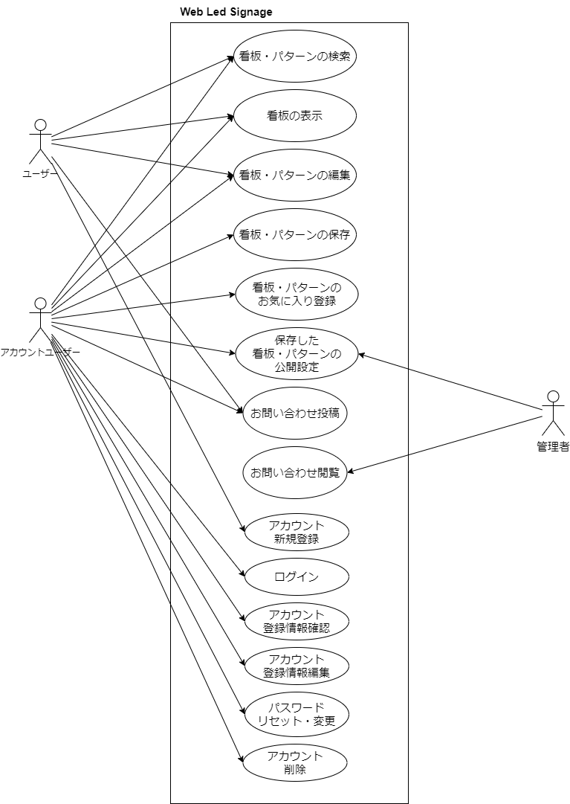
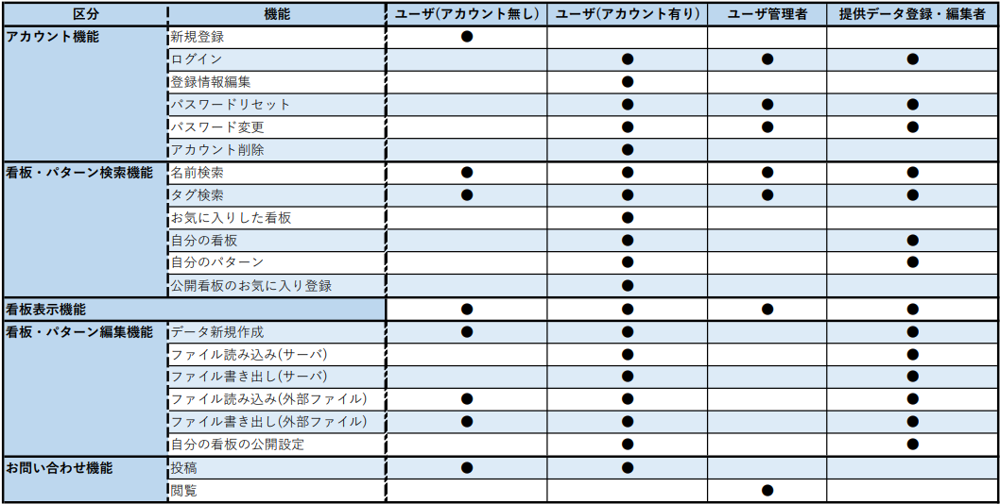
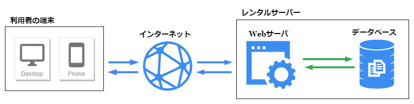

# 要件定義書

## 【概要】
Web上で動くLED電光掲示板の表示・編集を行うWebアプリケーションの新規開発に関する要件定義書です。

---
### 【サービス名】
『Web Led Signage』

---
### 【目的】
専用の機材を使うことなくLED電光掲示の再現をWeb上で行い、下記の用途で利用することを目指します。

1. 手持ちのタブレット端末やディスプレイをLED風の電光掲示として利用する。
2. (1)を実際にLED電光掲示板を導入する前の使用感チェック、デザイン提案・チェックなどに利用する。
3. 利用者の運営するWebページ上での利用。
4. 利用者が提供する動画・ストリーム配信上での利用。

マイコン機器等への書き込み等が出来るユーザー向けに、下記の用途で利用できることを目指します。

5. 実際のセグメントLED等のコントロール用データの作成・シュミレーション・データの出力を行う。
6. マイコンプログラミング等の学習用に表示データの提供を行う。

---
### 【背景】
高輝度LEDを利用した電光掲示は目に留まりやすく一定の需要があると考えられる。  
その一方で
* 実際の機器を導入するにはそれなりの金額が掛かる。
* 表示するデータは専用のソフトウェアを購入するか、業者への依頼が必要。

上記のように意外と導入する為のハードルは高いと考えられる。

Web上でLED看板を再現しシュミレーションすることが出来れば事前のチェックや本当に必要であるかの確認が出来る。  
ただし、ディスプレイの輝度は高輝度LEDにはどうしても劣るので、この点については考慮すべきと考える。

#### 【将来の展望】
また、今回のWebアプリケーション制作を通して表示データの構造を試作し、各社LED看板用のデータへの変換プログラムを提供が実現できれば  
LED看板の表示データを業界全体で共有したり、看板毎に依存するソフトウェアを購入する手間や費用を減らすことが可能になるかもしれない。  
ここで企画したデータ構造が業界に認められれば統一規格としての利用も考えて貰えるのかもしれない。

---
### 【ターゲット】
* 簡易的にLED電光掲示板を取り入れてみたい人
* LED電光掲示板の設置を検討している人
* Web上でLED電光掲示を再現したデザインを使いたい人
* LED機器向けの表示データを作成、出力したい人
* マイコンプログラミングの学習素材として利用したい人

---
### 【用語定義】
<dl>
	<dt>看板(Signage)</dt>
	<dd>実際にWeb上で再現するLED電光掲示</dd>
	<dt>パターン(Pattern)</dt>
	<dd>看板データを作る際に利用できる小さいサイズのパターン(文字や記号など)</dd>
	<dt>パターンパック</dt>
	<dd>パターンを文字コード等で紐づけしてまとめた物</dd>
</dl>

---
## 【システム方式・構成】
### 【機能要件】
#### 検索機能
* 公開設定されている看板、パターンデータを検索し閲覧出来る。
* データに付けられた名前、タグ、お気に入り登録(※要アカウント登録)した看板などで絞り込み検索が出来る。
* 看板-キーワード検索
* 看板-タグ検索
* パターン-キーワード検索
* パターン-タグ検索
* マイページから自分の作成した看板・パターンデータの一覧が表示出来る

#### 表示機能(Viewer)
* 自分の看板や、公開看板を選んで表示を行う。  
* コントロールパネルから看板の表示設定を行う。  
* 看板データの外部ファイル読み込みも可能とする。
* 看板データ-読み込み
* 看板の表示
* 看板の表示設定
予備
* プリセット機能(？)

#### 編集機能(Editor)
* 看板データ、パターンデータの新規作成・編集を行う。  
* 看板データ編集では既存のパターンデータを読み込んで取り入れる事が出来る。  
* 看板データやパターンデータのファイル読み込みや書き出しを行う。
* 看板データ-新規作成
* 看板データ-読み込み
* 看板データ-編集
* 看板データ-保存
* 看板データ-情報編集
* 看板データ-書き出し
* パターンデータ-新規作成
* パターンデータ-読み込み
* パターンデータ-編集
* パターンデータ-保存
* パターンデータ-情報編集
* パターンデータ-書き出し

#### アカウント機能
* アカウント新規登録
* アカウント認証（ログイン）
* アカウント登録情報編集
* パスワードリセット
* パスワード変更
* アカウント削除(退会)
* 作成した看板データの保存
* 自分の看板一覧
* 作成した看板データの削除
* 作成したパターンデータの保存
* 自分のパターン一覧
* 作成したパターンデータの削除
* 公開看板のお気に入り登録
* 公開看板のお気に入り解除

#### お問い合わせ機能(意見募集板)
* 投稿
* 閲覧(管理者のみ)

---
### 【非機能要件】
#### デバイス
* PC端末
* スマートフォン端末
* タブレット端末

#### 推奨環境
* Google Chrome(他のブラウザも試す)

#### セキュリティ仕様
* パスワードのハッシュ化
* XSS対策(クロスサイトスクリプティング)
* CSRF対策(クロスサイトリクエストフォージェリ)
* SQLインジェクション

#### 開発環境
開発環境:XAMPP, google chrome  
開発言語:HTML, Javascript, PHP  
利用フレームワーク:Laravel  

---
### 【利用者一覧】
* ユーザ(アカウント無し)
* ユーザ(アカウント有り)
* 管理者
* 提供データ登録編集者

### 【ユースケース図】

---
### 【ユーザ/機能マトリクス表】

---
### 【ハードウェア構成図】

---
### 【スケジュール】
画面作成  
データベース構築  
アカウント機能実装  
ファイル入出力機能実装  
表示機能実装  
編集機能実装  
検索/一覧/詳細表示機能実装  
マイページ機能実装  
お問い合わせ機能実装  